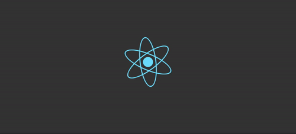

# Simple React App
<div>
<!--  -->

</div>

## Introduction
A very simple todo list application made using React.js. This is to serve as a starting point for your journey in creating beautiful client side applications using React.
### Getting Started
These instructions will help you get started in setting up your local environment to be able to build this application yourself.

#### Required Packages
You must already have a working copy of node and npm on your PC.
```
create-react-app
```
What create-react-app does for us, is give us a basic platform to start working on. Create-react-app takes care of downloading all the dependencies that we require to get started and also gives us some boiler plate code as well.

#### Installation
```npm i -g create-react-app```

## Creating Our First React App


