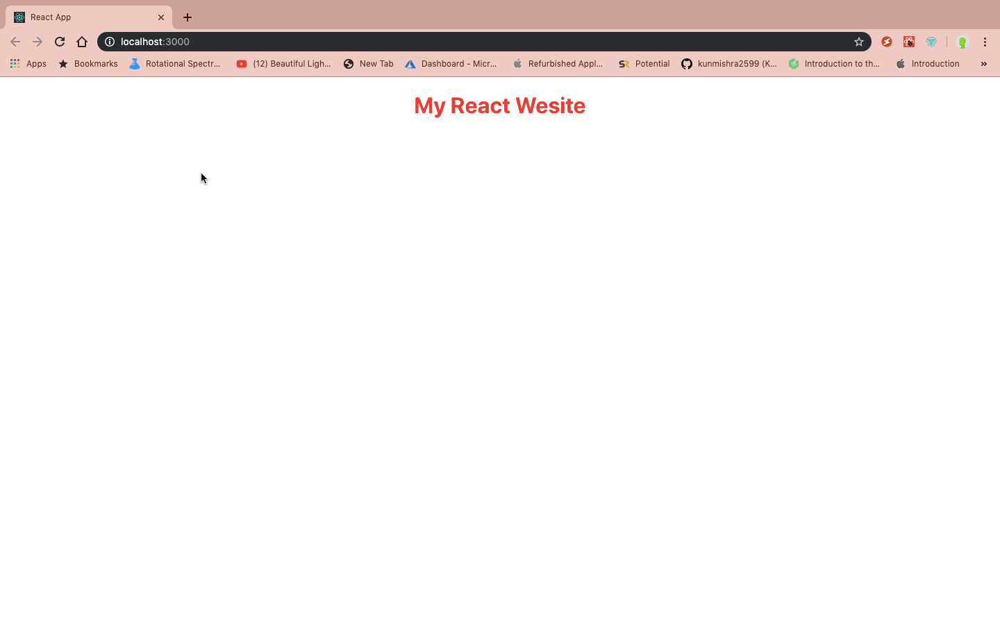

# Simple React App


## Introduction
A very simple todo list application made using React.js. This is to serve as a starting point for your journey in creating beautiful client side applications using React.
### Getting Started
These instructions will help you get started in setting up your local environment to be able to build this application yourself.

#### Required Packages
You must already have a working copy of node and npm on your PC.
```
create-react-app
```
What create-react-app does for us, is give us a basic platform to start working on. Create-react-app takes care of downloading all the dependencies that we require to get started and also gives us some boiler plate code as well.

#### Installation
```npm i -g create-react-app```

## Creating Our First React App
As you might have already guessed. We are going to use the create-react-app package to set up our new react application.

Open up your terminal window and navigate to a desired project directory. Once you are inside the desired directory, run the following command:
```
create-react-app my-application
```
Replace "my-application" with whatever name you want to give your applcation. For this particular run through, I've named my application <strong>todo-list</strong>.

## Running Our App
After setting up the application, now we navigate to it as such:
```
cd my-application
```
To start our application up on a live server we run the command:
```
npm start
```
Once you run this, the following screen should pop up on your browser:


### Experiment Time
You can start making this project truly yours by editing the App.js file in the src directory.

For example, replace all the content in App.js with the following block of code.

```javascript
import React from 'react';

const App = () => {
  return (
    <div style={{
      color: "red",
      justifyContent: "center",
      textAlign: "center"
    }}>
      <h1>My React Wesite</h1>
    </div >
  );
}

export default App;
```

Your website should now reload and you should see this on your screen,

